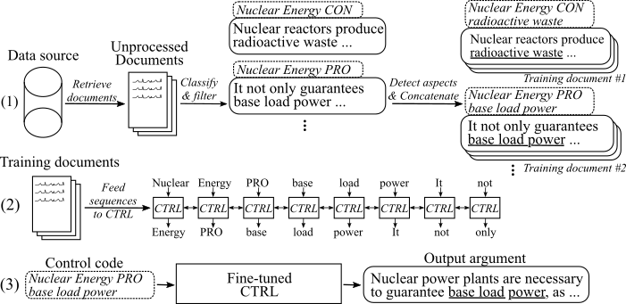

# Aspect-Controlled Neural Argument Generation

## Introduction
_Accompanying repository for the paper [Aspect-Controlled Neural Argument Generation](https://arxiv.org/abs/2005.00084)._

We rely on arguments in our daily lives to deliver our opinions and base them on evidence, making them more convincing 
in turn. However, finding and formulating arguments can be challenging. 
To tackle this challenge, we trained a language model (based on the CTRL by 
[Keskar et al. (2019)](https://arxiv.org/abs/1909.05858)) for argument generation that can be controlled on a fine-grained 
level to generate sentence-level arguments for a given topic, stance, and aspect. 
We define argument aspect detection as a necessary method to allow this fine-granular control and crowdsource a dataset 
with 5,032 arguments annotated with aspects. We release this dataset, as well as the training data for the argument generation
model, its weights, and the arguments generated with the model.

The following figure shows how the argument generation model was trained:

(1) We gather several million documents for eight different topics from two large data sources. 
All sentences are classified into pro-, con-, and non-arguments. We detect aspects of all arguments with a model trained
on a novel dataset and concatenate arguments with the same topic, stance, and aspect into training documents. 
(2) We use the collected classified data to condition the CTRL model
on the topics, stances, and aspects of all gathered arguments. (3) At inference, passing the control code 
_[Topic]_ _[Stance]_ _[Aspect]_ will generate an argument that follows these commands.

## Updates
**15. May 2020**

We have added the code for the aspect-controlled neural argument generation model and detailled descriptions on how
to use it. The model and code modifies the work by [Keskar et al. (2019)](https://arxiv.org/abs/1909.05858). 
The link to the fine-tuned model weights and training data can be found in the [Downloads section](#downloads).

**8. May 2020**

The _Argument Aspect Detection_ dataset can be downloaded from [here](https://tudatalib.ulb.tu-darmstadt.de/handle/tudatalib/2329)
(_argument_aspect_detection_v1.0.7z_). 
From there, you can also download the arguments generated with the argument generation models (_generated_arguments.7z_) and the data 
to reproduce the fine-tuning of the argument generation model (_reddit_training_data.7z_, _cc_training_data.7z_).

_Note_: Due to license reasons, these files cannot be distributed freely. Clicking on any of the files will redirect you to a form,
where you have to leave you name and email. After submitting the form, you will receive a download link shortly.

## Downloads

- Download datasets from [here](https://tudatalib.ulb.tu-darmstadt.de/handle/tudatalib/2329). You can download the following files:
    
    - _argument_aspect_detection_v1.0.7z_: The argument aspect detection dataset
    - _generated_arguments.7z_: All arguments generated with our fine-tuned models
    - _reddit_training_data.7z_: Holds classified samples used to fine-tune our model based on [Reddit-comments](https://files.pushshift.io/reddit/comments/) data
    - _cc_training_data.7z_: Holds classified samples used to fine-tune our model based on [Common-Crawl](https://commoncrawl.org/) data

    _Note_: Due to license reasons, these files cannot be distributed freely. Clicking on any of the files will redirect you to a form,
    where you have to leave you name and email. After submitting the form, you will receive a download link shortly.

- Use _scripts/download_weights.sh_ to download the model weights. The script will download the weights for the model
fine-tuned on [Reddit-comments](https://files.pushshift.io/reddit/comments/) and [Common-Crawl](https://commoncrawl.org/) data
and unzips them into the main project folder. 

## Installation
The code was tested with `Python3.6`. Install all requirements with 
    
    pip install -r requirements.txt 
    
and follow the instructions in the [original Readme at _Usage_](README_original.md#usage), _Step 1 and 2_.

##### Todos
   
    
    FINAL TOUCH:
    - all files checken, die mit underscrore am ende löschen
    - credentials löschen 

## Usage
In the following, we describe three approaches to use the aspect-controlled neural argument generation model:

[A. Use model for generation only](#a-use-model-for-generation-only)

[B. Use available training data to reproduce/fine-tune the model](#b-use-given-training-data-to-reproducefine-tune-the-model)

[C. Use your own data to fine-tune a new aspect-controlled neural argument generation model](#c-use-your-own-data-to-fine-tune-a-new-aspect-controlled-neural-argument-generation-model)

### A. Use model for generation only
In order to generate arguments, please first download the weights for the models (download script at _scripts/download_weights.sh_). 
Run the model via `python generation.py --model_dir reddit_seqlen256_v1` for the model trained
on Reddit-comments data or `python generation.py --model_dir cc_seqlen256_v1` for the model trained on Common-Crawl data. 
After loading is complete, type in a control code, for example `nuclear energy CON waste`, to generate arguments 
that follow this control code. To get better results for the first generated argument, you can end the control code with 
a period or colon ("." or ":"). For more details, please refer to the paper. 

_Note_: Allowed control codes for each topic and data source can be found in the _training_data_ folder.

### B. Use given training data to reproduce/fine-tune the model
In order to fine-tune the model as we have done in our work, please follow these steps:

1. Download the pre-trained weights from the original paper 
([original Readme at _Usage_](README_original.md#usage), _Step 3_). 
2. Download the training data (see [Downloads section](#downloads). You need the file _reddit_training_data.7z_ or _cc_training_data.7z_. 
Depending on the source (cc or reddit), put the archives either
into folder _training_data/common-crawl-en/_ or _training_data/redditcomments-en/_  and unzip via:

        7za x [FILENAME].7z

3. To reproduce the same training documents from the training data as we used for fine-tuning, please use the script at
_training_utils/pipeline/prepare_documents_all.sh_ and adapt the _INDEX_ parameter.
Depending on your hardware, the training document generation can take an hour or more to compute.

4. Lastly, TFRecords need to be generated from all training documents. To do so, please run:

        python make_tf_records_multitag.py --files_folder [FOLDER] --sequence_len 256
        
     [FOLDER] needs to point to the folder of the training documents, 
     e.g. _training_data/common-crawl-en/abortion/final/_. After generating, the number of
     training sequences generated for this specific topic is printed. Use this to determine the
     number of steps the model should be trained on. The TFRecords are stored in folder _training_utils_.

5. Train the model:

        python training.py --model_dir [WEIGHTS FOLDER] --iterations [NUMBER OF TRAINING STEPS]
        
    The model takes the generated TFRecords automatically from the _training_utils_ folder.
    Please note that the weights in [WEIGHTS FOLDER] will be overwritten. For generation with
    the newly fine-tuned model, follow the instructions in "_A. Use model for generation only_".

### C. Use your own data to fine-tune a new aspect-controlled neural argument generation model

To ease the process of gathering your own training data, we add our implementation of the pipeline described
in our publication (see [I. Use our pipeline (with ArgumenText API)](#i-use-our-pipeline-with-argumentext-api)). To label sentences as arguments and to identify their stances and aspects, we
use the [ArgumenText-API](https://api.argumentsearch.com). Alternatively, you can also train your own models 
(see [II. Create your own pipeline (without ArgumenText API)](#ii-create-your-own-pipeline-without-argumentext-api)).

#### I. Use our pipeline (with ArgumenText API)
Please [request](https://api.argumentsearch.com/en/api_registration) a userID and apiKey for the 
[ArgumenText-API](https://api.argumentsearch.com). Write both id and key in the respective
constants at _training_utils/pipeline/credentials.py_.

##### a. Data retrieval
As a first step, training documents for a topic of interest need to be gathered. (_Note: This step is not part of the code
 and has to be self-implented_). We did so by downloading a dump from
[Common-Crawl](https://commoncrawl.org/) and [Reddit-comments](https://files.pushshift.io/reddit/comments/) and indexing 
them with [ElasticSearch](https://www.elastic.co). The outcome needs to be documents 
that are stored at _training_data/[INDEX_NAME]/[TOPIC_NAME]/unprocessed/_, where [INDEX_NAME] is the name of the 
data source (e.g. _common-crawl-en_) and [TOPIC_NAME] is the search topic for which documents were gathered 
(replace whitespaces in the [INDEX_NAME] and [TOPIC_NAME] with underscores).
Each document is a separate JSON-File with at least the key "sents" which holds a list of sentences from this document:

    {
        "sents": ["sentence #1", "sentence #2", ...]
    }

##### b. Argument  and stance classification
The _argument_classification.py_ takes all documents gathered for a given topic and classifies their sentences into
pro-/con-/non-Arguments. The following command starts the classification:

    python argument_classification.py --topic [TOPIC_NAME] --index [TOPIC_NAME]

Non-arguments are discarded and the final classified arguments are stored into files with a maximum of 200,000 arguments each at 
_training_data/[INDEX_NAME]/[TOPIC_NAME]/processed/_.

##### c. Aspect detection
The _aspect_detection.py_ parses all previously classified arguments and detects their aspects. 
The following command starts the aspect detection:

    python aspect_detection.py --topic [TOPIC_NAME] --index [TOPIC_NAME]
    
All arguments with their aspects are then stored into a single file _merged.jsonl_ at
_training_data_/[INDEX_NAME]/[TOPIC_NAME]/processed/.

##### d. Prepare training documents
The _prepare_documents.py_ appends all arguments that have the same topic, stance, and (stemmed) aspect to a training document:

     python prepare_documents.py --max_sents [MAX_SENTS] --topic [TOPIC_NAME] --index [INDEX_NAME] --max_aspect_cluster_size [MAX_ASPECT_CLUSTER_SIZE] --min_aspect_cluster_size [MIN_ASPECT_CLUSTER_SIZE]

[MAX_SENTS] sets the maximum number of arguments to use (evenly devided between pro and con arguments if possible)
and [MIN_ASPECT_CLUSTER_SIZE]/[MAX_ASPECT_CLUSTER_SIZE] sets the min/max number of allowed arguments to append for a 
single training document. The final documents are stored in folder _training_data/[INDEX_NAME]/[TOPIC_NAME]/final/_. 
The script _prepare_all_documents.sh_ can be used to automate the process.

Finally, to create training sequences from the documents and start fine-tuning the model, please download our fine-tuned 
weights (see [Download section](#downloads)) and follow 
[B. Use given training data to reproduce/fine-tune the model](#b-use-given-training-data-to-reproducefine-tune-the-model),
 Steps 4-5.

_IMPORTANT_: In addition to the training documents, a file with all control codes based on the training 
documents is created at _training_data/[INDEX_NAME]/[TOPIC_NAME]/generation_data/control_codes.jsonl_. This file holds
all control codes to generate arguments from after fine-tuning has finished. 

#### II. Create your own pipeline (without ArgumenText API)
##### a. Argument and stance classification
To train an argument and stance classification model, you can use the [UKP Corpus](https://www.ukp.tu-darmstadt.de/sent_am) 
and the models described in the corresponding publication by [Stab et al. (2018)](https://www.aclweb.org/anthology/D18-1402/). For better
results, however, we suggest to use BERT [(Devlin et al., 2019)](https://www.aclweb.org/anthology/N19-1423/).

##### b. Aspect detection
To train an aspect detection model, please download our [Argument Aspect Detection dataset](https://tudatalib.ulb.tu-darmstadt.de/handle/tudatalib/2329) 
(due to license reasons, it is necessary to fill the form with your name and email). As a model, we suggest 
BERT from [Huggingface](https://github.com/huggingface/transformers) for sequence tagging.

##### c. Prepare training documents and fine-tune the model
In order to prepare training documents and fine-tune the model, you can use the _prepare_documents.py_ as described in 
[I. Use our pipeline (with ArgumenText API), step d.](#d-prepare-training-documents)
 if you keep your classified data in the following format:

- The file should be named _merged.jsonl_ and located in the directory _training_data/[INDEX_NAME]/[TOPIC_NAME]/processed/_, 
where [INDEX_NAME] is the data source from where the samples were gathered and [TOPIC_NAME] the name of the respective
search query for this data.
- Each line represents a training sample in the following format:
    
        {"id": id of the sample, starting with 0 (int), "stance": "Argument_against" or "Argument_for", depending on the stance (string), "sent": The argument sentence (string), "aspect_string": A list of aspects for this argument (list of string)}   

## Citing
If you find this work helpful, please cite our publication [Aspect-Controlled Neural Argument Generation](https://arxiv.org/abs/2005.00084):

    @misc{schiller2020aspectcontrolled,
        title={Aspect-Controlled Neural Argument Generation},
        author={Benjamin Schiller and Johannes Daxenberger and Iryna Gurevych},
        year={2020},
        eprint={2005.00084},
        archivePrefix={arXiv},
        primaryClass={cs.CL}
    }

Contact person: [Benjamin Schiller](mailto:schiller@ukp.informatik.tu-darmstadt.de)

https://www.ukp.tu-darmstadt.de/